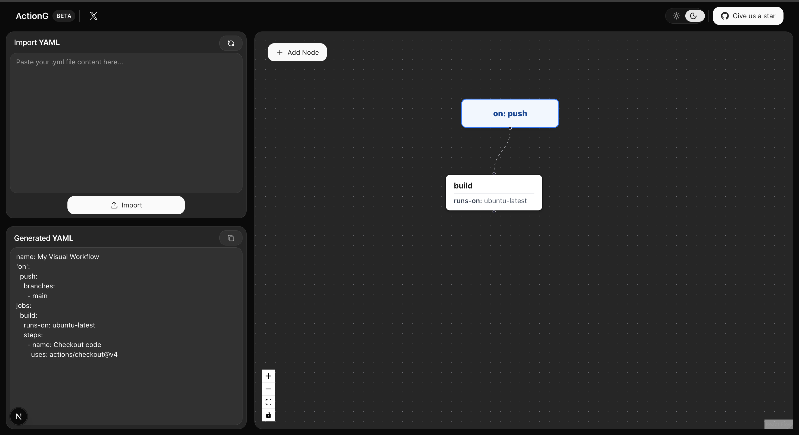

<h1 align="center">ActionG</h1>

<p align="center">
An interactive open-source visualizer for your GitHub Actions workflows.
</p>



## Why ActionG?

- Visually build your CI/CD pipeline, import existing YAML to see a graph, and generate perfect code back instantly.

- 😫 Stop the "Push-and-Pray" Cycle<br>
Writing GitHub Actions YAML is a slow, frustrating loop: edit, commit, push, wait 5 minutes, watch it fail, and repeat. Action Visualizer fixes this by giving you a live, visual editor with instant feedback.

- It's an authoring tool designed to help you build and refactor your workflows before you ever commit.

## What can ActionG do?
- Round-Trip Editing: The killer feature. Paste in your existing, complex .yml file to instantly generate a visual, editable graph. Edit the graph, and get perfect YAML back.

- Visual Editor: Build complex workflows by adding and connecting nodes. Click a node and "Add Job" to automatically create a dependency.

- Deep Editing: Double-click any Job or Trigger node to open a detailed modal.

- Job Editor: Edit the runs-on field and manage all your steps in a clean UI.

- Trigger Editor: Visually build complex on: blocks, adding triggers like push, pull_request, and their branches.

- Live YAML Output: Watch the YAML code generate in real-time as you build and edit your graph. No more syntax errors.

- Built for Developers: A 100% client-side tool built with Next.js, React Flow, and TypeScript.

## How to Use?
- Import (Code-to-Visual):

- Copy the YAML from one of your existing projects.

- Paste it into the "Import YAML" box and click <br>"Import."

- Your workflow is now a visual graph.

- Edit (Visual-to-Visual):

- Double-click the build job. Add a new step in the modal and click "Save."

- Double-click the on: push trigger. Add a pull_request trigger and click "Save."

- Click the build node, then click "Add 'Job' Node" in the toolbox. A new job is created that needs: build.

- Export (Visual-to-Code):

- Copy the clean, perfectly formatted code from the "Generated YAML" panel.

- Paste it back into your .github/workflows file.

## Tech Stack
- Framework: Next.js / React

- Language: TypeScript

- Canvas: React Flow

- YAML Parsing: js-yaml

## Development

```bash
cd actiong
bun install
bun dev
```

## License & Contributing

This project uses the MIT license. See the [LICENSE](LICENSE) file for details.

## Contact & Support

Found a bug or have feedback? Feel free to [DM me on X](https://x.com/bind_deepesh).